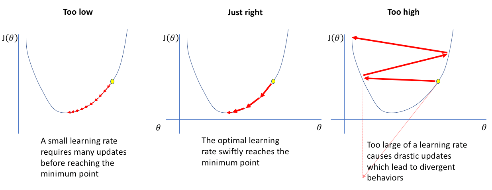

# Logistic Regression

## Introduction

Logistic Regression is a supervised machine learning algorithm used for classification problems. It predicts the probability that an input belongs to a specific class. It is typically used for *binary classification* where the output can be one of two possible categories such as `Yes/No`, `True/False` or `0/1`.

## Assumptions of Binary Logistic Regression

1. **Independent observations:** Logistic regression assumes that the observations in the dataset are independent of each other. That is, the observations should not come from repeated measurements of the same individual or be related to each other in any way.

2. **Independent features:** Features must be independent of each other. There should be no correlation or dependence between features.

3. **Meaningful features**: We must include meaningful independent variables in our model. The model assumes a linear relationship between the independent variables and the log odds of the dependent variable.

3. **Binary dependent variables:** It takes the assumption that the dependent variable must be binary. Meaning, it can take only two values.

4. **No extreme outliers:** The dataset should not contain extreme outliers as they can distort the estimation of the logistic regression coefficients.

5. **Large sample size:** It requires a sufficiently large sample size to produce reliable and stable results.

## How Logistic Regression Works

The main idea behind Logistic Regression is to model the probability that a given input belongs to a particular class.

1. **Linear Combination of Input Features**: It starts by computing a linear combination of the input features:
    $$
    z = w_1 x_1 + w_2 x_2 + ... + w_n x_n + b
    $$
    or simply,
    $$
    z = \left(\sum^n_{i = 1} w_i x_i\right) + b
    $$

    Where:  
    - $x_i$ are the input features
    - $w_i$ are the weights (parameters learned during training)
    - $b$ is the bias term

    The output $z$ from the linear combination of features is called the *log odds* or *logit*.

2. **Sigmoid Activation Function:** Then, it applies a sigmoid function to convert this linear output into a probability:
    $$
    \sigma(z) = \frac{1}{1 + e^{-z}}
    $$

    Binary Logistic Regression uses sigmoid function to convert inputs into a probability value between 0 and 1

    

    
    

    This function takes any real number and maps it into the range 0 to 1 forming an "S" shaped curve called the sigmoid curve or logistic curve.

3. **Interpreting the Output:** The result  is interpreted as the probability that the input belongs to the positive class (e.g., class 1).  
    
    We predict class 1 if $\sigma(z) > 0.5$, otherwise class 0.

## Training

In our model, $w_1$, $w_2$, ..., $w_n$ and $b$ are trainable parameter.

This means the model doesn’t start with fixed values for them. Instead, it learns what their values should be in order to make accurate predictions. To do this, we use an optimization technique called *Gradient Descent*.

### Loss Function

A loss function is a mathematical way to measure how good or bad a model’s predictions are compared to the actual results.

It compares the model’s predicted value, $\hat{y}$​ with the actual value, $y$ and gives a number that tells us how far off the predictions are. The smaller the number, the better the model is doing. 

Loss functions are used to train models. They are important because they:

- **Guide Model Training:** During training, algorithms such as Gradient Descent use the loss function to adjust the model's parameters and try to reduce the error and improve the model’s predictions.
- **Measure Performance:** By finding the difference between predicted and actual values and it can be used for evaluating the model's performance.
- **Affect learning behavior:** Different loss functions can make the model learn in different ways depending on what kind of mistakes they make.

There are many types of loss functions each suited for different tasks like regression and classification. For Binary Logistic Regression, it uses a loss function known as **Binary Cross-Entropy Loss (Log Loss)**.

The total Binary Cross-Entropy Loss over a dataset of $m$ examples is given as:
$$
\mathcal{L} = - \frac{1}{m} \sum_{i=1}^{m} \left[ y_{i} \log( \hat{y}_{i}) + (1 - y_{i}) \log(1 - \hat{y}_{i}) \right]
$$
where:
- ${y}_{i}$ is the true label of example $i$.
- $\hat{y}_{i}$ is the predicted probability of example $i$.
- $\mathcal{L}$ is the final averaged loss.
- $m$ is the total number of examples in the dataset.

### Gradient Descent

Gradient Descent is an optimization algorithm used to minimize the loss function in machine learning models like Logistic Regression.

In simple terms:
- The loss function tells us how wrong the model’s predictions are.
- Gradient Descent helps us find the best model parameters (weights and bias) that reduce this loss as much as possible.

Think of it like finding the lowest point in a valley (minimum loss) by always stepping in the direction of the steepest slope downhill.

### How Gradient Descent Works

1. **Start with initial values:** for the weights and biases (often small random numbers).

2. **Make predictions:** using the current weights and bias.

3. **Calculate the loss:** between the predicted values and the actual labels.

4. **Compute gradients:** Determine how much each weight and bias contributes to the loss.

5. **Update parameters:** by taking a small step in the opposite direction of the gradient:

    $$
    w_i \leftarrow w_i - \eta \cdot \frac{\partial \mathcal{L}}{\partial w_i}
    $$

    $$
    b \leftarrow b - \eta \cdot \frac{\partial \mathcal{L}}{\partial b}
    $$
    
    where 
        $\eta$ is the learning rate (a small positive number that controls how big the step is). If the learning rate is too small, training is slow. If it is too large, the model may overshoot the minimum or even diverge (go unstable).

    

    
    

6. **Repeat** this process over many iterations (epochs) until the loss is minimized or stops changing significantly.

So we can observe:
- The gradient tells us which direction is uphill.
- We go in the opposite direction to reduce the loss.
- The learning rate tells us how far to step each time.