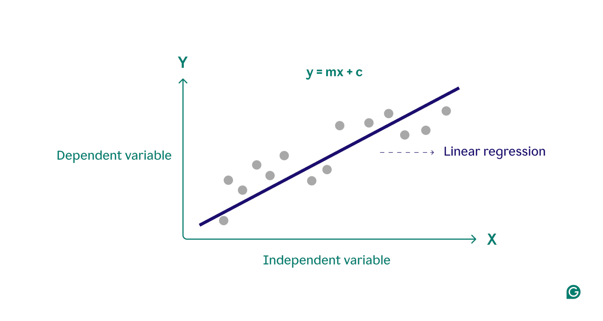
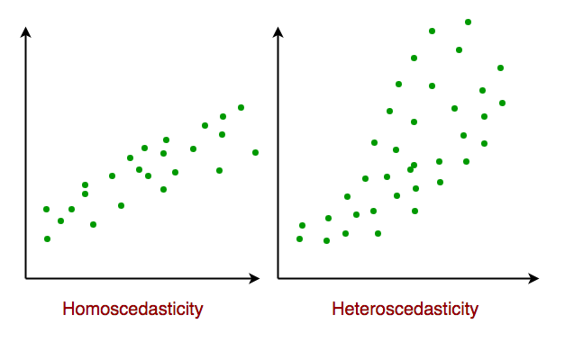

# Linear Regression

## Introduction

Linear regression is a type of *supervised* machine-learning algorithm. It is a statistical method used to model the *linear relationship* between a dependent variable (also called the target or output) and one or more independent variables (also called features or predictors).

Linear regression assumes that there is a *linear relationship* between the input and output, meaning the output changes at a constant rate as the input changes. This relationship is represented by a straight line.

## Assumptions of Linear Regression

1. **Linearity:** The relationship between inputs (X) and the output (Y) is a straight line.

2. **Independent Observations:** The observations should not come from repeated measurements of the same individual or be related to each other in any way.

3. **Lack of Multicollinearity**: The input variables should not be closely related to each other. In other words, the input features should not be correlated with each other.

4. **Constant Variance (Homoscedasticity):** The errors should have equal spread across all values of the input. If the spread changes (like fans out or shrinks), it's called heteroscedasticity and it is a problem for the model.

5. **Normality:**  The residuals (the differences between observed and predicted values) should follow a normal distribution.

## Line of Best Fit

### Simple Linear Regression

Simple linear regression involves one independent variable. The goal is to find the best-fitting straight line that predicts the dependent variable using this single feature.

The formula for making a prediction in simple linear regression is:
$$
\hat{y} = {\beta}_0 + {\beta}_1 x_1
$$

where:
- $\hat{y}$ is the predicted value of the dependent variable
- $\beta_0$ is the intercept (the value of $\hat{y}$ when $x_1 = 0$)
- $\beta_1$ is the coefficient (slope) that represents the effect of $x_1$ on $\hat{y}$
- $x_1$ is the value of the independent variable

### Multiple Linear Regression

Multiple linear regression extends simple linear regression by using more than one independent variable. The prediction is made using a weighted sum of all the input features:
$$
\hat{y} = {\beta}_0 + {\beta}_1 x_1 + {\beta}_2 x_2 + ... + {\beta}_n x_n
$$

where:
- $x_1, x_2, \ldots, x_n$ are the independent variables
- $\beta_1, \beta_2, \ldots, \beta_n$ are their corresponding coefficients
- $\beta_0$ is the intercept term
- $\hat{y}$ is the predicted value of the dependent variable

## Objective of Linear Regression

The objective of linear regression is to find the values of the coefficients ($\beta_0, \beta_1, ..., \beta_n$) that minimize the difference between the predicted values $\hat{y}$ and the actual values $y$. This difference is often measured using the **Mean Squared Error (MSE)**. This is our **loss function**.
$$
\text{MSE} = \frac{1}{m} \sum_{i=1}^{m} \left( y_i - \hat{y}_i \right)^2
$$

where:

- $m$ is the number of data points
- $y_i$ is the actual value
- $\hat{y}_i$ is the predicted value

To minimize this error, we use an optimization algorithm, **Gradient Descent**.

**Gradient Descent** is used to find the optimal values of the model parameters ($\beta_0, \beta_1, \ldots, \beta_n$). It works by:
- Calculating the error using the loss function (MSE).
- Computing the gradient, which tells us the direction and rate of steepest increase in error
- Updating the model parameters in the opposite direction of the gradient to reduce the error

The update rule for each parameter $\beta_j$ looks like this:
$$
\beta_j \leftarrow \beta_j - \alpha \frac{\partial}{\partial \beta_j} \text{MSE}
$$

where:
- $\alpha$ is the **learning rate**, a small positive value that controls the step size
- $\frac{\partial}{\partial \beta_j} \text{MSE}$ is the partial derivative of the loss function with respect to the parameter $\beta_j$

